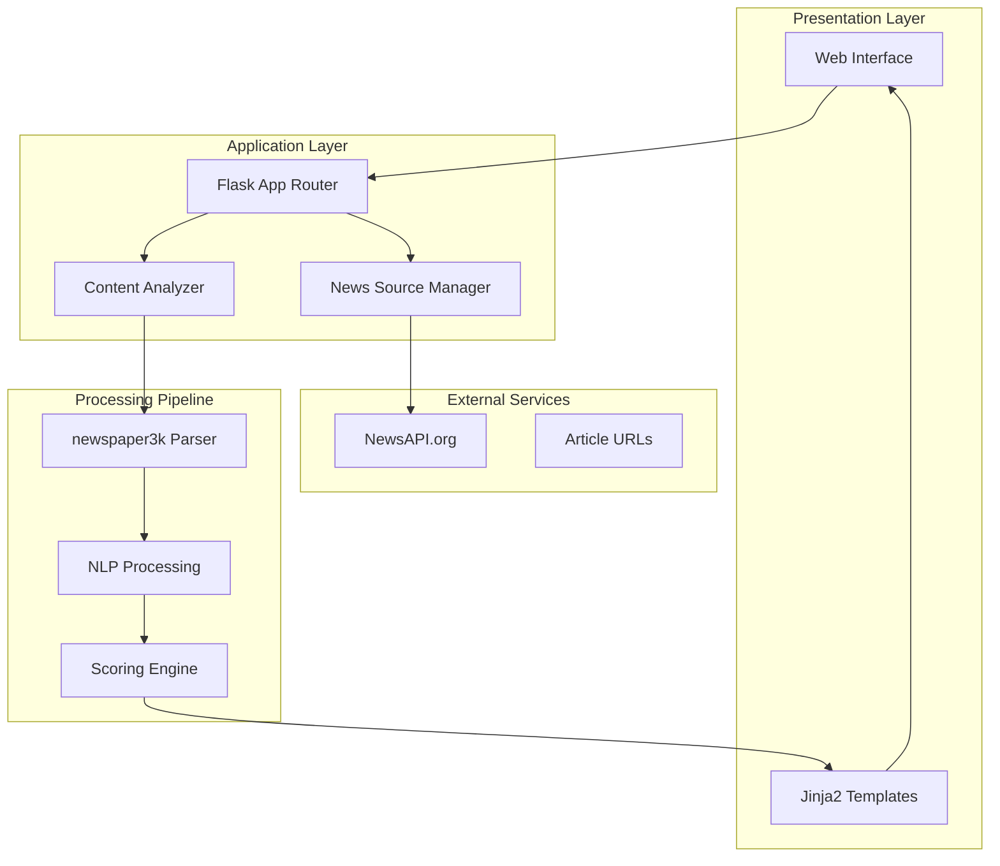
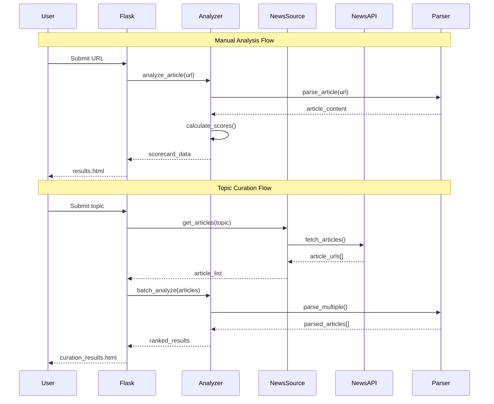

# Design Document

## Overview

Curator is architected as a Flask-based web application with a modular design that separates concerns between web routing, content analysis, and external data sourcing. The system follows a three-tier architecture with presentation (Flask templates), business logic (scoring engine), and data access (NewsAPI integration) layers.

The application emphasizes real-time processing for manual analysis while supporting batch processing capabilities for topic-based curation. The scoring engine uses a weighted composite approach combining multiple NLP and metadata-based metrics to produce reliable content quality assessments.

## Architecture

### High-Level System Architecture



### Component Interaction Flow



## Components and Interfaces

### Core Application Components

#### 1. Flask Application Router (`app.py`)
- **Purpose**: HTTP request handling and route management
- **Key Routes**:
  - `GET /` - Homepage with input forms (Analyze & Curate)
  - `POST /analyze` - Manual analysis: returns JSON for JSON requests; otherwise renders `results.html`
  - `POST /curate-topic` - Topic curation: returns JSON for JSON requests; otherwise renders `curation_results.html`
- **Dependencies**: Flask, python-dotenv for configuration
- **Error Handling**: Custom error pages for 400/500/404 status codes; consistent UI via base template
- **Requirements Mapping**: 1.1, 1.3, 2.2, 4.1, 6.4

#### 2. Content Analyzer (`analyzer.py`)
- **Purpose**: Core scoring logic and NLP processing orchestration
- **Key Methods**:
  - `analyze_article(url)` - Single article analysis
  - `batch_analyze(articles)` - Multiple article processing
  - `calculate_composite_score(metrics)` - Weighted score calculation
- **Scoring Components**:
  - Readability Score (word count threshold with normalization)
  - NER Density Score (spaCy entities per 100 words)
  - Sentiment Score (NLTK VADER, neutrality favored)
  - TF-IDF Relevance Score (scikit-learn cosine similarity)
  - Recency Score (publication date with exponential decay, timezone-safe)
- **Requirements Mapping**: 3.1–3.6

#### 3. News Source Manager (`news_source.py`)
- **Purpose**: NewsAPI integration and article URL management
- **Key Methods**:
  - `fetch_articles_by_topic(topic)` - Topic-based article retrieval with validation
  - `get_article_urls(topic, max_articles)` - Extract valid URLs with size cap
  - `check_api_status()` - Health probe for integration diagnostics
- **Resilience**: Rate limiting with backoff, retries, and consistent error modeling
- **Configuration**: API key management, request parameters, error handling
- **Requirements Mapping**: 2.1, 2.4, 2.5, 6.3

### Data Models and Structures

#### Article Data Model
```python
@dataclass
class Article:
    url: str
    title: str
    author: str
    publish_date: datetime
    content: str
    summary: str
    entities: List[Entity]
    
@dataclass
class Entity:
    text: str
    label: str  # PERSON, ORG, GPE, etc.
    confidence: float

@dataclass
class ScoreCard:
    overall_score: float
    readability_score: float
    ner_density_score: float
    sentiment_score: float
    tfidf_relevance_score: float
    recency_score: float
    article: Article
```

#### Configuration Model
```python
@dataclass
class ScoringConfig:
    readability_weight: float = 0.2
    ner_density_weight: float = 0.2
    sentiment_weight: float = 0.15
    tfidf_relevance_weight: float = 0.25
    recency_weight: float = 0.2
    min_word_count: int = 300
    max_articles_per_topic: int = 20
```

### External Service Interfaces

#### NewsAPI Integration
- **Endpoint**: `https://newsapi.org/v2/everything`
- **Authentication**: API key via header
- **Rate Limits**: 1000 requests/day (developer tier)
- **Response Format**: JSON with articles array
- **Error Handling**: HTTP status codes, rate limit headers

#### Article Parsing Interface
- **Library**: newspaper3k
- **Input**: Article URL
- **Output**: Structured article data (title, content, metadata)
- **Error Handling**: Parsing failures, timeout handling, encoding issues, retries with varied user agents
- **Requirements Mapping**: 1.1, 6.2, 6.4

## Presentation Layer Design
### API (SaaS/IaaS) Specification

The service exposes a REST API suitable for SaaS/IaaS integration. A full OpenAPI 3.0 document is provided at `./openapi.yaml`.

Key endpoints:
- POST `/analyze` — Single-article analysis (supports `use_embeddings` toggle)
- POST `/curate-topic` — Topic-based curation and ranking
- POST `/compare` — Pairwise similarity (URLs or raw text), TF‑IDF baseline with optional embeddings
- GET `/health` — Health check

Authentication:
- API key via `X-API-Key` header (see `components.securitySchemes.ApiKeyAuth`)

Schemas:
- `AnalyzeRequest`, `AnalyzeResponse`, `CurateRequest`, `CurateResponse`, `CompareRequest`, `CompareResponse`, plus shared `Article`, `Entity`, and `ScoreCard` types.

This API design enables programmatic consumption for downstream products and integrations.

### Templates and UI Behavior
- `base.html` provides a light, professional theme, responsive nav, Inter font, and full-width layout with centered content containers
- `index.html` includes two clear entry points with tabbed navigation:
  - Analyze: URL input + optional query, embeddings toggle, loading states, inline errors, and an on-page result card with progress bars
    - Additional stats surfaced: word count, entity count, source domain, publish date, and which relevance method was used
    - Entities rendered as compact chips
  - Curate: topic input, max articles, sorting, min-score filter, search, and pagination; results rendered as ranked cards
- `results.html` displays a single analysis scorecard: overall score + component bars, summary, and harmonized visual style
- `curation_results.html` displays a ranked list of articles with scores and summaries; cards aligned with the new design system
- `compare.html` provides a two-column comparison UI for similarity checks between two inputs (URLs or raw texts), with TF‑IDF baseline and optional embeddings visualization
- Error templates `400.html`, `404.html`, `500.html` extend base for consistent UI

### Client-Side Enhancements
- JS enhances UX without breaking API contracts:
  - Analyze: populates the scorecard card, progress bars, and stats; renders entities as chips; optional embeddings toggle passed per request
  - Curate: sorting (asc/desc), min-score filter, search, and pagination
  - Compare: posts inputs to `/compare` and renders A→B/B→A/Avg scores (TF‑IDF and embeddings)
  - Loading and error states for both forms

### Accessibility & Responsiveness
- Mobile-first layout, accessible contrast, keyboard-focusable controls, and centered max-width containers on wide screens

### Requirements Mapping
- 4.1, 4.2, 4.3, 4.4 satisfied via the above templates and behaviors

### Database Schema (Future Enhancement)
While the initial implementation uses in-memory processing, the design supports future database integration:

```sql
-- Articles table for caching parsed content
CREATE TABLE articles (
    id SERIAL PRIMARY KEY,
    url VARCHAR(2048) UNIQUE NOT NULL,
    title TEXT,
    author VARCHAR(255),
    publish_date TIMESTAMP,
    content TEXT,
    summary TEXT,
    created_at TIMESTAMP DEFAULT CURRENT_TIMESTAMP,
    updated_at TIMESTAMP DEFAULT CURRENT_TIMESTAMP
);

-- Scores table for caching analysis results
CREATE TABLE scores (
    id SERIAL PRIMARY KEY,
    article_id INTEGER REFERENCES articles(id),
    overall_score FLOAT,
    readability_score FLOAT,
    ner_density_score FLOAT,
    sentiment_score FLOAT,
    tfidf_relevance_score FLOAT,
    recency_score FLOAT,
    created_at TIMESTAMP DEFAULT CURRENT_TIMESTAMP
);

-- Named entities table
CREATE TABLE entities (
    id SERIAL PRIMARY KEY,
    article_id INTEGER REFERENCES articles(id),
    text VARCHAR(255),
    label VARCHAR(50),
    confidence FLOAT
);
```

### Scoring Algorithm Design

#### Composite Score Calculation
```python
def calculate_composite_score(metrics: Dict[str, float], config: ScoringConfig) -> float:
    """
    Weighted composite score calculation
    All component scores normalized to 0-100 range
    """
    weighted_sum = (
        metrics['readability'] * config.readability_weight +
        metrics['ner_density'] * config.ner_density_weight +
        metrics['sentiment'] * config.sentiment_weight +
        metrics['tfidf_relevance'] * config.tfidf_relevance_weight +
        metrics['recency'] * config.recency_weight
    )
    return min(100.0, max(0.0, weighted_sum))
```

#### Individual Score Calculations

**Readability Score**:
- Word count threshold (300+ words = higher score)
- Sentence complexity analysis
- Paragraph structure evaluation

**NER Density Score**:
- Entity count per 100 words
- Entity type diversity (PERSON, ORG, GPE, etc.)
- Entity confidence weighting

**Sentiment Score**:
- VADER compound score normalization
- Neutral sentiment preference for news content
- Extreme sentiment penalty for bias detection

**Relevance Score** (TF‑IDF baseline with semantic option):
- TF‑IDF cosine similarity between article and query, with fallbacks
  - Word 1–2 grams with English stopwords
  - Character 3–5 grams fallback
  - Jaccard lexical overlap fallback
- Optional semantic relevance via embeddings (SentenceTransformers), controlled by flag or per-request toggle

**Recency Score**:
- Exponential decay function based on publication date
- Configurable half-life parameter
- Maximum age threshold

## Error Handling

### Error Classification and Response Strategy

#### Client Errors (4xx)
- **Invalid URL Format**: Return 400 with validation message
- **Article Not Found**: Return 404 with alternative suggestions
- **Rate Limit Exceeded**: Return 429 with retry-after header

#### Server Errors (5xx)
- **NewsAPI Unavailable**: Return 503 with fallback message
- **Parsing Failures**: Return 500 with generic error page
- **NLP Processing Errors**: Graceful degradation with partial scores

#### Error Handling Implementation
```python
@app.errorhandler(400)
def bad_request(error):
    return render_template('errors/400.html', 
                         message="Invalid input provided"), 400

@app.errorhandler(500)
def internal_error(error):
    return render_template('errors/500.html', 
                         message="An unexpected error occurred"), 500

def safe_analyze_article(url: str) -> Optional[ScoreCard]:
    """
    Wrapper function with comprehensive error handling
    """
    try:
        return analyze_article(url)
    except requests.RequestException:
        logger.error(f"Network error fetching {url}")
        return None
    except Exception as e:
        logger.error(f"Analysis error for {url}: {str(e)}")
        return None
```

### Retry Logic and Circuit Breaker Pattern
- **NewsAPI Requests**: Exponential backoff with jitter
- **Article Parsing**: 3 retry attempts with different user agents
- **Circuit Breaker**: Fail fast after consecutive failures

## Testing Strategy

### Unit Testing Approach

#### Component Testing
- **Analyzer Module**: Mock article content, test scoring algorithms
- **News Source Module**: Mock API responses, test error handling
- **Flask Routes**: Test request/response cycles with test client

#### Test Data Strategy
```python
# Sample test fixtures
SAMPLE_ARTICLE = {
    'url': 'https://example.com/article',
    'title': 'Sample Technology Article',
    'content': 'Lorem ipsum...' * 100,  # 300+ words
    'publish_date': datetime.now() - timedelta(hours=2)
}

SAMPLE_NEWSAPI_RESPONSE = {
    'status': 'ok',
    'totalResults': 5,
    'articles': [...]
}
```

#### Integration Testing
- **End-to-End Workflows**: Test complete user journeys
- **External Service Mocking**: Use responses library for API mocking
- **Database Integration**: Test with in-memory SQLite for future features

### Performance Testing Considerations
- **Load Testing**: Simulate concurrent user requests
- **Memory Profiling**: Monitor NLP model memory usage
- **Response Time Benchmarks**: Target <3s for single article analysis

### Security Testing
- **Input Validation**: Test URL injection attempts
- **API Key Protection**: Verify environment variable isolation
- **XSS Prevention**: Test template output escaping

## Deployment Architecture

### Development Environment
- **Local Development**: Flask development server
- **Dependencies**: Virtual environment with requirements.txt
- **Configuration**: .env file for local settings

### Production Deployment Options

#### Option 1: Traditional Server Deployment
- **Web Server**: Nginx reverse proxy
- **WSGI Server**: Gunicorn with multiple workers
- **Process Management**: Systemd service files
- **Monitoring**: Application logs and health checks

#### Option 2: Containerized Deployment
```dockerfile
FROM python:3.10-slim
WORKDIR /app
COPY requirements.txt .
RUN pip install -r requirements.txt
COPY . .
EXPOSE 5000
CMD ["gunicorn", "--bind", "0.0.0.0:5000", "app:app"]
```

#### Option 3: Cloud Platform Deployment
- **Heroku**: Procfile with web dyno configuration
- **AWS Elastic Beanstalk**: Application bundle deployment
- **Google Cloud Run**: Containerized serverless deployment

### Environment Configuration Management
```python
# Production configuration
class ProductionConfig:
    DEBUG = False
    TESTING = False
    NEWS_API_KEY = os.environ.get('NEWS_API_KEY')
    SECRET_KEY = os.environ.get('SECRET_KEY')
    MAX_CONTENT_LENGTH = 16 * 1024 * 1024  # 16MB
    
# Development configuration  
class DevelopmentConfig:
    DEBUG = True
    TESTING = False
    NEWS_API_KEY = os.environ.get('NEWS_API_KEY', 'dev-key')
```

### Scalability Considerations

#### Horizontal Scaling
- **Stateless Design**: No server-side session storage
- **Load Balancing**: Multiple application instances
- **Caching Layer**: Redis for frequently accessed articles

#### Performance Optimization
- **Async Processing**: Celery task queue for batch operations
- **Content Delivery**: CDN for static assets
- **Database Optimization**: Connection pooling and query optimization

#### Monitoring and Observability
- **Application Metrics**: Response times, error rates
- **Business Metrics**: Articles processed, user engagement
- **Infrastructure Metrics**: CPU, memory, network usage

#### Notes
- **Use the venv (.venv) everytime need to run the python code**
- **Always Put and edit code on its Apropriate location**
- **Using PEP8 are must**